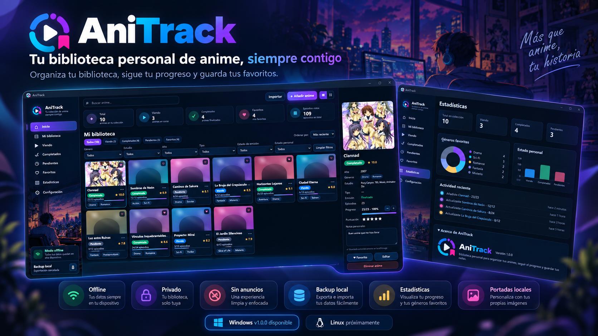
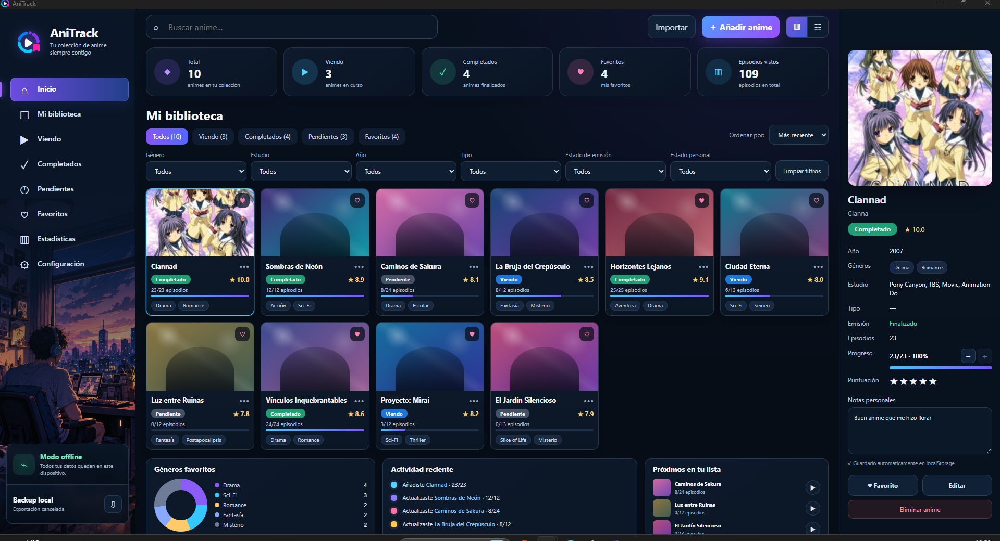
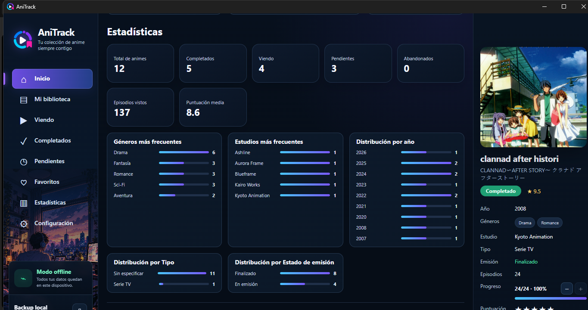

# AniTrack

### Tu biblioteca personal de anime, siempre contigo.

Organiza tu biblioteca, sigue tu progreso, guarda tus favoritos y conserva tus datos localmente.

**Gratuito · Offline-first · Sin anuncios · Privado**

[📥 Ver descargas](../../releases) · [📄 Licencia](LICENSE.txt) · [📝 Changelog](CHANGELOG.md)

---

  

## 🎌 ¿Qué es AniTrack?

**AniTrack** es una aplicación de escritorio para organizar una biblioteca personal de anime de forma sencilla, visual y privada.

Permite registrar lo que está viendo, llevar el progreso de episodios, marcar favoritos, añadir puntuaciones y notas, utilizar portadas propias, consultar estadísticas y crear respaldos de la biblioteca.

AniTrack fue diseñado con una filosofía **offline-first**: la biblioteca permanece en el dispositivo y no requiere una cuenta ni conexión permanente a Internet para su funcionamiento normal.

---

## ✨ Características principales

- 📚 Biblioteca personal de anime.
- ▶️ Seguimiento de episodios y progreso.
- ✅ Estados personales: viendo, completado, pendiente, pausado y abandonado.
- ❤️ Favoritos.
- ⭐ Puntuaciones.
- 📝 Notas personales.
- 🖼️ Portadas locales.
- 🔎 Búsqueda, filtros y ordenamiento.
- 📊 Estadísticas de la colección.
- 💾 Exportación e importación de backups.
- 🔒 Datos almacenados localmente.
- 🌐 Funcionamiento offline.
- 🚫 Sin anuncios.
- 💜 Uso gratuito.

---

## 🖥️ AniTrack Desktop para Windows

La primera versión de escritorio está dirigida a **Windows x64**.

> **Estado actual:** AniTrack Desktop v1.0.0 se encuentra en validación final de un hotfix de backup antes de habilitar la publicación pública definitiva.

Cuando la versión estable esté publicada, el instalador oficial estará disponible en la sección **Releases** de este repositorio.

### Requisitos de Windows

- Windows 10 u 11 de 64 bits.
- 2 GB de RAM como mínimo recomendado para la primera versión.
- Resolución mínima de 1280 × 720.
- Microsoft Edge WebView2.
- Espacio adicional según el tamaño de la biblioteca y las portadas.
- Internet no requerido para el uso normal una vez instalada la aplicación.

> Si WebView2 no está presente en el equipo, el instalador puede necesitar conexión a Internet para obtenerlo.

---

## 📸 Capturas reales

### Biblioteca

  

### Estadísticas

  

---

## 🔒 Privacidad y almacenamiento local

AniTrack no necesita una cuenta de usuario para funcionar.

En la versión Desktop para Windows:

- la biblioteca y las preferencias se almacenan localmente;
- las portadas se guardan como archivos locales;
- los datos permanecen separados de la carpeta de instalación;
- reinstalar o actualizar la aplicación no debe borrar la biblioteca existente;
- la desinstalación conserva los datos salvo que el usuario solicite expresamente eliminarlos.

AniTrack no reclama propiedad sobre la biblioteca, notas, portadas ni demás información introducida por el usuario.

---

## 💾 Backups

AniTrack permite exportar e importar respaldos de la biblioteca.

El formato de backup conserva la información necesaria para restaurar la colección y sus portadas. Se recomienda mantener copias periódicas en una ubicación segura.

---

## 🐧 Linux — Próximamente

La siguiente etapa del proyecto será la validación de **AniTrack Desktop para Linux**.

Las distribuciones objetivo iniciales son:

- Ubuntu;
- Debian;
- Zorin OS.

Zorin OS será utilizado como uno de los sistemas reales de prueba. También se evaluarán formatos de distribución como **`.deb`** y **AppImage** para ampliar la compatibilidad.

---

## 💜 Apoyar AniTrack

AniTrack es gratuito y no bloquea funciones detrás de pagos o suscripciones.

Las donaciones son completamente voluntarias y ayudan a mantener el desarrollo y las futuras versiones del proyecto.

[💜 Apoyar el proyecto](https://www.paypal.com/donate/?hosted_button_id=C8P69N3QPVD56)

---

## ⚖️ Licencia

AniTrack se distribuye bajo la **Licencia de Uso Gratuito de AniTrack**.

**© 2026 Ren Kael. Todos los derechos reservados.**

AniTrack es software gratuito, pero **no es actualmente un proyecto de código abierto**. La publicación del código fuente queda a decisión del desarrollador.

Consulte [LICENSE.txt](LICENSE.txt) para conocer los términos completos.

---

## ℹ️ Contenido de terceros

AniTrack no reproduce ni distribuye contenido audiovisual.

Los nombres, imágenes, marcas y demás material relacionado con obras de terceros pertenecen a sus respectivos titulares. Las imágenes añadidas por cada usuario permanecen bajo su responsabilidad y derechos correspondientes.

---

### AniTrack

**Biblioteca personal de anime · Offline-first · Gratuito**

Hecho con ♥ por **Ren Kael** · Guatemala · 2026

